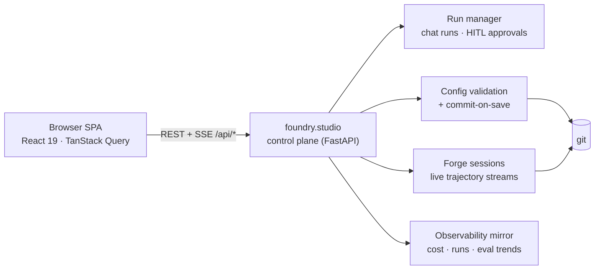

# agent-foundry-studio

[](https://github.com/samueleldridge/agent-foundry-studio/actions/workflows/ci.yml)


The web console for [agent-foundry](https://github.com/samueleldridge/agent-foundry) — a React app over every foundry CLI feature: projects, config editing with live server-side validation, catalog exploration, doctor, cost/latency dashboards, evals, versions/rollback, runs, connections, and storage — plus chat with streamed responses and in-chat human-approval gates, a multi-agent flow-graph visualisation, a live meta-agent (forge) console, AI-assisted eval authoring, and user-composable widget dashboards.

This repo is intentionally **separate** from the framework repo: it has its own git history, and `agent-foundry` never contains Node artifacts. The backend control-plane API (`foundry.studio`) lives there and serves this app's built assets.



> **No backend? No problem.** `npm install && npm test` runs the full suite completely offline: every API is mocked with [msw](https://mswjs.io/) and SSE streams ride a shared EventSource mock — no backend process, no API keys, no network. Lint, typecheck, and build are equally standalone; only `npm run dev` and `npm run generate:api` need the real control plane.

## Prerequisites

- Node ≥ 22 (developed on v26) + npm
- *For live development against a real backend only:* a checkout of `agent-foundry` as a **sibling directory** (`../agent-foundry`), with its Python env set up (`uv sync`)

## Development

Run the backend control plane in one terminal:

```bash
cd ../agent-foundry
uv run foundry studio --port 4400
```

Then the Vite dev server here:

```bash
npm install
npm run dev          # http://localhost:5173, /api proxied to :4400
```

Set `FOUNDRY_STUDIO_API` to point the proxy elsewhere.

## Production serve

```bash
npm run build        # emits dist/
cd ../agent-foundry
uv run foundry studio          # finds ../agent-foundry-studio/dist automatically
# or: FOUNDRY_STUDIO_DIST=/abs/path/to/dist uv run foundry studio
```

`foundry studio` serves the SPA (with history-fallback routing) and the `/api/*` control plane from one port.

## Scripts

| Script | What |
|---|---|
| `npm run dev` | Vite dev server with `/api` proxy |
| `npm run build` | typecheck + production build to `dist/` |
| `npm test` / `npm run test:watch` | vitest (jsdom + msw; no real backend needed) |
| `npm run lint` / `npm run typecheck` | eslint / `tsc --noEmit` |
| `npm run generate:api` | regenerate `src/api/schema.d.ts` from the running backend's `/openapi.json` |
| `npm run generate:api:check` | fail if the committed types drift from the served OpenAPI |

## Stack

React 19 + Vite + TypeScript (strict) · Tailwind CSS v4 + shadcn/ui (Radix) + lucide-react · TanStack Query · React Router · CodeMirror 6 (YAML/prompt editing) · Recharts · @xyflow/react + dagre (flow graph) · react-grid-layout (widget dashboards) · vitest + testing-library + msw. Dark/light theme is class-based, persisted to localStorage, and follows `prefers-color-scheme` by default.

## Layout

- `src/api/` — typed client + generated OpenAPI types + the `useSSE` hook
- `src/components/` — shared primitives (DataTable, CodeEditor, EventFeed, charts, shadcn `ui/`)
- `src/features/<area>/` — one directory per screen area (projects, configs, catalog, doctor, obs, evals, versions, runs, connections, storage, settings, chat, graph, forge, approvals)
- `src/widgets/` — the widget registry (the settled 12) + widget components
- `src/dashboard/` — react-grid-layout host + server-side layout persistence (`PUT /api/layouts`)
- `src/theme/` — ThemeProvider + toggle
- `tests/` — vitest suites (msw-mocked API; SSE driven through a shared EventSource mock), one file per feature area

The normative spec (routes, screens, widget system, graph schema) is the framework repo's `docs/72-web-studio.md`.
